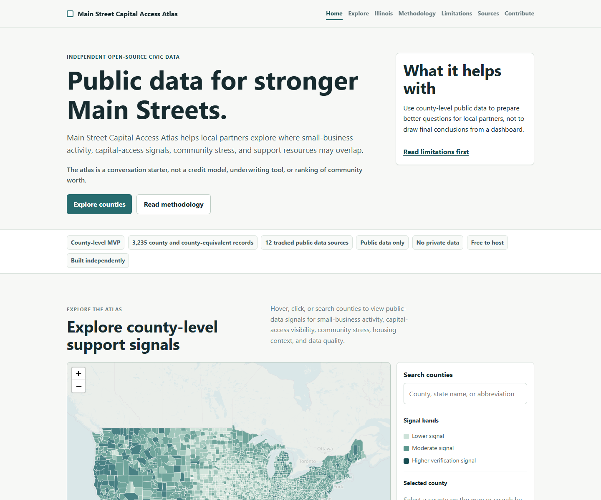

# Main Street Capital Access Atlas

[](#deploy-on-github-pages)
[](pyproject.toml)
[](LICENSE)

**Public data for stronger Main Streets.**

Main Street Capital Access Atlas is an independent, open-source civic data project that helps local partners identify where small-business opportunity, capital-access signals, community stress, and support resources may overlap.

It turns public county-level data into static, shareable "Main Street Opportunity Briefs" for local verification, partnership development, capital-navigation support, and community conversation.

> This project is built independently using public data. It is not affiliated with, endorsed by, or sponsored by any financial institution, government agency, or data publisher.

## Live Demo

The site is designed for GitHub Pages and builds into `site/dist/`. After the repository is published, the default GitHub Pages URL is expected to be:

https://jmracich.github.io/mainstreet-capital-access-atlas/

To preview locally:

```bash
python -m mainstreet_atlas.cli all
python -m http.server 8000 -d site/dist
```

Open `http://localhost:8000/index.html`.

## Site Preview



The generated map includes OpenStreetMap contributor attribution in the interactive site.

## Project Output

The build generates a static website in `site/dist/`, including a national county search dataset, map-ready GeoJSON, top-level methodology pages, the Illinois spotlight, and county brief pages.

Release notes are tracked in [CHANGELOG.md](CHANGELOG.md).

For local preview, run `python -m mainstreet_atlas.cli all`, then serve `site/dist/` with `python -m http.server 8000 -d site/dist`.

The public data export includes `counties.csv`, `counties.json`, `county-map.geojson`, `source_manifest.json`, a generated `data_dictionary.csv` / `data_dictionary.json` that documents every county-export column, and `data_package_manifest.json` with file sizes, row or feature counts, and SHA-256 checksums. The CSV and JSON exports include every county and county-equivalent record; the map GeoJSON is scoped to the contiguous-U.S. homepage choropleth for browser performance.

## Why This Matters

Local partners often need to understand several signals at once: small-business density, bank branch presence, public lending signals, household stress, housing pressure, and the local support ecosystem. Those datasets are public, but scattered across federal portals, large downloads, and manual reports.

This project provides a transparent, reproducible starting point. It is designed to help banks, CDFIs, chambers, nonprofits, libraries, local governments, economic-development teams, student volunteers, and community partners ask better questions before acting.

## A Personal Note

I am passionate about this project because access to useful civic data should not depend on budget, technical capacity, or institutional reach. Open, readable public-data tools can help people see where support may be needed, prepare better local conversations, and connect small businesses with partners who can help them move forward.

## What It Does

- Builds a national county-level public-data dataset when sources are available.
- Generates a polished static website suitable for GitHub Pages.
- Creates an Illinois spotlight as the first launch focus.
- Generates county brief pages with cautious, locally verifiable language.
- Tracks source availability, source vintage, and missingness.
- Uses a transparent 0-100 **Small Business Support Priority Signal**.

## What It Does Not Do

- It is not a credit model.
- It is not an underwriting tool.
- It does not measure business quality or borrower creditworthiness.
- It does not determine whether any bank, government, nonprofit, or CDFI should lend or invest.
- It does not replace local residents, business owners, or community organizations.

Data should start conversations, not end them.

## Data Sources

The default build uses only free public data and no private data.

| Source | Default status | Purpose |
| --- | --- | --- |
| U.S. Census County Business Patterns downloadable files | Automated | Establishments, employment, payroll, small-establishment share, industry concentration |
| U.S. Census Population Estimates Program county file | Automated | Resident population denominators for rate calculations |
| U.S. Census SAIPE all-counties workbook | Automated | Poverty and median household income context |
| FDIC BankFind public API and Summary of Deposits | Automated | Bank branch presence, branch density, and branch deposit context |
| Census cartographic boundary files | Automated | County names, FIPS, centroids, map geometry |
| Census ACS 5-year API | Optional API key | Poverty, income, unemployment, rent burden, vehicle, internet, household, and education context |
| BLS Local Area Unemployment Statistics | Manual CSV adapter | County unemployment rate |
| FFIEC CRA small-business lending | Manual CSV adapter | Public small-business lending signal |
| SBA 7(a)/504 public data | Manual county CSV adapter | SBA lending activity |
| CDFI Fund certified CDFI list | Manual county CSV adapter | Mission-driven financial ecosystem |
| HUD Fair Market Rents / Income Limits | Optional/manual | Housing-cost pressure context |

Manual import templates are documented in [data/manual/README.md](data/manual/README.md).

Attribution and citation guidance is documented in [CITATION.cff](CITATION.cff) and [docs/attribution.md](docs/attribution.md). Reusers should cite this project separately from the underlying public data publishers listed in the source manifest.

## How the Signal Works

The **Small Business Support Priority Signal** is a public-data conversation starter from 0 to 100. It is calculated from available normalized components:

- 20% small-business importance signal
- 20% capital-access visibility gap
- 20% community economic stress
- 15% housing/cost pressure
- 15% local support ecosystem gap
- 10% data-quality gap / verification need

Normalization uses winsorized percentiles to reduce extreme outlier impact. Directionality is explicit: for some indicators higher values increase local verification priority; for others lower values do.

When a source is missing, the score is calculated from available components and the county page shows missingness and a data quality grade. Missing data is not silently replaced with made-up values.

## Run Locally

```bash
make install
make all
make test
make serve
```

Open `http://localhost:8000` after `make serve`.

Common commands:

```bash
python -m mainstreet_atlas.cli fetch
python -m mainstreet_atlas.cli build
python -m mainstreet_atlas.cli generate-site
python -m mainstreet_atlas.cli all
```

On Windows machines without `make`, run the direct Python commands above. The Makefile is a convenience wrapper around the same commands.

Optional environment variables:

```bash
CENSUS_API_KEY=your_key_here
HUD_API_TOKEN=your_token_here
CRA_YEAR=2024
```

You can place the same values in a local `.env` file. `.env` is ignored by Git and should never be committed.

The default build succeeds without these values. Optional token sources are marked unavailable when credentials are not present.
Set `SITE_URL` to the final public site URL when building for deployment. When it is set, the static site also generates `sitemap.xml` and includes it in `robots.txt`. The GitHub Pages deploy workflow sets this automatically from the repository URL unless a `SITE_URL` repository variable is configured.

## Deploy on GitHub Pages

1. Push this repository to GitHub.
2. Enable GitHub Pages for GitHub Actions.
3. Run the `Deploy GitHub Pages site` workflow manually or push to `main`.
4. The workflow builds `site/dist` and deploys it using official Pages actions.

The monthly `Refresh public data` workflow can refresh public sources and open a generated-data artifact or commit updated outputs when permitted.

## Roadmap

### V0.1

- National county-level dataset
- Illinois spotlight
- County brief generator
- Static map
- Methodology and limitations

### V0.2

- Add ZIP-level or tract-level detail where reliable
- Add SBDC/SCORE/chamber resource mapping
- Add local partner submission workflow
- Add PDF export for briefs

### V0.3

- Add state spotlight templates
- Add versioned datasets
- Add downloadable county brief packs
- Add more robust CRA/SBA/CDFI ingestion

## Contribute

See [CONTRIBUTING.md](CONTRIBUTING.md). The most valuable contributions are source-quality improvements, careful language improvements, state spotlights, accessibility fixes, and local resource datasets with clear provenance.

Accessibility commitments and issue-reporting guidance are documented in [docs/accessibility.md](docs/accessibility.md).

Project stewardship and methodology/source-change expectations are documented in [GOVERNANCE.md](GOVERNANCE.md).

For issue routing and maintainer scope, see [SUPPORT.md](SUPPORT.md). For suspected vulnerabilities, exposed credentials, or accidental sensitive-data disclosure, follow [SECURITY.md](SECURITY.md) and do not post sensitive details publicly.

## License

MIT. See [LICENSE](LICENSE).
